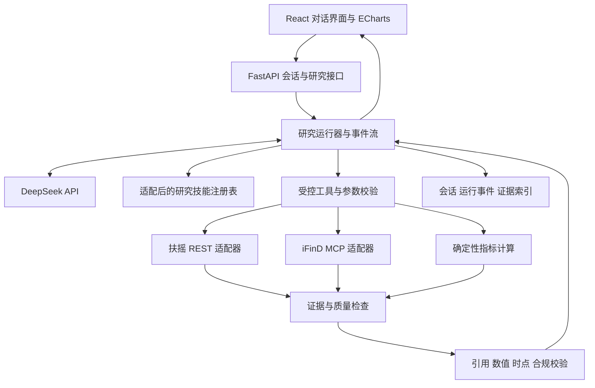

# A 股市场大势研判：产品与技术实施规划

版本：讨论稿 v0.1 · 2026-10-07。本文是实施建议，不代表产品、模型调用或数据接入已完成。

需求基准：[原始任务](../01_AI驱动的股票市场大势研判.md)。配套材料：[工具包与数据源核查](02_工具包与数据源核查.md)。

## 1. 已确定的方向与待确认事项

已确定：使用用户持有 API Key 的 DeepSeek 模型；充分复用 investment-masters-toolkit 的研究方法；采用左侧会话历史、中央 AI 对话的简洁 Web 产品形态；回答能够呈现文字、表格和交互图表。功能围绕市场状态、主要矛盾、证据和判断改变条件展开。

用户已确认首版用于“本人研究 + 评审体验”；扶摇/iFinD 权限尚未确认，先核查接入方式。按小规模产品设计，优先研究日频和最新已完成交易日。盘中问题可展示快照，但必须明确盘中截点，不与收盘数据混用。部署平台待定。

产品的核心体验：用户提出一个市场问题，Agent 制定取数计划，调用金融数据工具，给出有依据、可追溯、可继续追问的回答。成功标准是用户能理解判断及其局限，并找到支持或推翻判断的证据。

## 2. 首版范围

| 能力 | 首版落地方式 | 验收表现 |
|---|---|---|
| 大势研判 | A 股整体及用户指定宽基指数，明确区间和数据截至时间 | 有结论、主要矛盾、七维证据状态和切换条件 |
| 风格研究 | 大小盘、成长/价值、红利等可核实指数的相对表现 | 图表同起点、同区间、同价格或全收益口径 |
| 行业研究 | 行业相对强弱、扩散程度、事件传导 | 行业比较及可核实事件，不输出个股买卖名单 |
| 风险变量 | 成交活跃度、杠杆、利率等已验证数据 | 说明变量如何影响当前判断及其反证 |
| 历史阶段 | 用户指定两段时期的同口径比较 | 明确相似点、不同点、缺失维度，不外推未来收益 |
| 连续对话 | 继承指数、时间范围、研究假设及证据版本 | “那小盘呢？”能正确继承并说明范围 |
| 证据查看 | 正文引用、图表来源、按需展开详情 | 一次点击回到原始字段/原文及计算口径 |

首版不增加交易执行、持仓管理、选股推荐、收益预测、自动推送、策略优化或大师人格切换。大师方法作为后台研究视角使用，避免增加无关产品入口。文件上传、复杂账号体系、自动搜索相似历史阶段、PDF 精排导出放在核心任务完成后评估。

## 3. 市场状态框架

采用“七维证据 + 当前状态描述 + 主要矛盾 + 切换条件”，避免将所有指标简单压成一个买卖分数。

| 维度 | 回答的问题 | 候选指标及约束 |
|---|---|---|
| 行情结构 | 指数之间同步还是分化？ | 区间收益、MA20/60、滚动波动、回撤；指标由代码计算 |
| 市场宽度 | 指数表现有多大范围的股票参与？ | 上涨/下跌/平盘家数、上涨占比、站上均线占比；明确样本与有效分母 |
| 风格轮动 | 强势集中在哪类风格？ | 风格指数相对收益、行业扩散、排名变化；避免重复计算重叠样本 |
| 估值 | 当前估值处于怎样的历史或横向位置？ | 指数 PE/PB、历史分位；负盈利、样本不足和指数聚合口径单独说明 |
| 流动性 | 交易活跃度、融资条件如何变化？ | 全市场成交额、融资余额、可用利率；成交额不能直接称作资金净流入 |
| 情绪 | 交易是否集中、极端或显著分歧？ | 涨跌停、炸板、波动、热度；热榜不等同全市场情绪 |
| 重要事件 | 什么可能解释现象或改变判断？ | 政策/公告/宏观事件时间线、原文、传导路径、替代解释 |

状态候选词可包括“广泛修复、结构分化、震荡整理、广泛承压、证据不足”。这是拟定的描述词表，阈值与组合规则需要在固定历史样本上审查、版本化；不称为经验证的预测模型。

各维度分别返回：观察事实、方向/程度描述、证据覆盖、冲突和不确定性。主判断由这些结果归纳，不能把一个指数当作全市场，也不能因为缺数据就补“中性”。整体行情与宽度缺少关键证据时，仅呈现已证实的局部情况，整体状态为“证据不足”。

置信度采用高/中/低/无法评估，并解释覆盖度、时效性、口径一致性和相互印证情况。关键数据缺失或冲突时限制置信度上限；同源转载、同一底层数据的多个指标不算独立验证。置信度表示证据对当前描述的支持程度，不是涨跌概率。

切换条件必须可检查：包含指标、比较基准或阈值、观察窗口、需要维持的期数、触发后的判断调整及依据。具体阈值由规则配置和研究验证确定，模型不得临时捏造。例子仅表达结构：“若参与上涨的股票比例持续改善，且多数行业相对表现同步改善，则重新评估‘上涨集中’的判断。”

## 4. 如何充分复用工具包

采用“研究方法改编 + 已审查计算函数 + 统一数据适配”三层复用。原包保留作对照，生产运行时只加载适配后的技能。

| 本项目研究模块 | 复用来源 | 改造方向 |
|---|---|---|
| market-state | market-review、support-resistance、indicator-backtest | 多指数复盘、量价与波动观察，补齐真正的市场宽度和状态规则 |
| style-rotation | comparison、CANSLIM、PEG、low-pe-high-div | 从个股筛选转为成长/价值/红利及大小盘风格的解释与比较 |
| valuation-context | valuation、basic、safety-margin | 保留历史分位、价值陷阱与盈利质量视角；不把低估值转成建仓建议 |
| liquidity-risk | capital-flow-calc-a、capital-flow-report | 保留“量—质—势—位”观察法、归一化与持续性；重新核实字段语义 |
| event-context | info-analysis、event-price-in | 新闻时间线、事件与价格反应交叉核对；把因果与 price-in 断言改成待验证假设 |
| industry-followup | industry-chain、event-penetration、financial | 行业传导路径和反证；财务数据使用披露时点，停止于行业研究 |
| historical-context | comparison、indicator-backtest、max-pessimism | 历史阶段指标对比、压力与估值组合；不生成抄底或收益推断 |
| institutional-context（按需） | national-team、shareholder-change、etf-holdings | 仅在有可靠披露时补充机构行为背景，不推断实时“护盘” |

每个适配技能建议具有：skill_id、版本、原参考文件、适用问题、所需数据、可调用工具、计算规则、解释规则、禁用输出、数据不足行为、示例和关联测试。为每个被实际使用的方法建立“原参考 → 改动 → 指标/提示词 → 测试”的追踪关系。

技能规模不大，先用显式注册表和按需读取 Markdown，避免第一版就增加向量数据库。每次加载与问题相关的少量技能，保留“简单问题一个模块、复杂问题多维组合”的原包路由思路。路由使用模型结构化判断与确定性约束，不仅靠关键词。

原包的 SQL、MCP 连接代码、样例数据和评分阈值均不视为已验证实现；具体问题见核查文档。用户所说的“高质量”应体现在研究深度与证据严谨性上，不能替代代码和口径验证。

## 5. 推荐技术架构

建议采用 **React + TypeScript + Vite 前端，Python FastAPI 后端，DeepSeek 工具调用，ECharts 图表**。前端适合会话和图表交互；Python 适合复用工具包中的 pandas/NumPy 方法与金融计算。本项目无明确 SEO 或服务端页面渲染需求，首版无需为此引入 Next.js。



| 层 | 建议选择 | 理由与边界 |
|---|---|---|
| 界面 | React、TypeScript、Vite、Tailwind、可访问的基础组件 | 聊天单页应用，组件与状态明确 |
| 内容 | 安全 Markdown、表格、ECharts 按需加载 | 禁用模型生成的任意 HTML/JS，图表走受控规格 |
| 后端 | FastAPI、Pydantic、httpx、pandas、NumPy | 输入/输出校验、异步取数、复用计算方法 |
| 模型 | DeepSeek 官方 API；使用兼容协议 SDK | SDK 名称不代表更换模型供应商，所有推理仍走 DeepSeek |
| 工具协议 | 扶摇优先 REST，iFinD 使用官方 MCP SDK | 显式数据契约便于核对；MCP 连接生命周期交给成熟客户端 |
| 编排 | 单个有界 Agent 运行器 + 明确状态机 | 易追踪、可取消、可验证；不先引入多 Agent/复杂编排框架 |
| 持久化 | 首版 SQLite + 本地持久卷；多人/多实例选 PostgreSQL | 会话、消息、研究运行、事件、证据索引；不能部署到易丢失的临时磁盘 |
| 部署 | 一个容器服务，同源托管前端静态文件与 API，HTTPS 入口 | 减少跨域和双端部署复杂度；平台最终待选 |

FastAPI 单服务不等于全部任务都阻塞在请求线程：I/O 异步，CPU 计算移到有界执行器。首版限制同时运行的研究数；需要横向扩容、可靠长任务队列时再增加独立 worker。未完成运行遇服务重启必须标记为 interrupted，不能永久显示“正在研究”。

### DeepSeek 接入策略

本次官方文档展示了 `deepseek-flash`、`deepseek-v4-pro` 和工具调用能力。模型 ID 通过 `DEEPSEEK_MODEL` 配置，实施时以用户账号实际可用型号及冒烟测试为准，不写死历史别名。优先验证一个型号跑完整链路，再决定复杂研究是否需要另一 DeepSeek 型号；首版不做多模型投票或训练。

首个接入测试必须覆盖：普通问答、流式返回、一次工具调用、多轮工具结果回填、结构化结果解析、中断、限流和超时。采用 DeepSeek 原生参数时显式封装，不假设兼容 SDK 的全部能力都适用。Beta strict schema 可以实验，但不作为首版前置条件；服务端 Pydantic 校验始终保留。

API Key 仅在后端环境变量/部署密钥中配置，不进入浏览器、提示词、日志、截图或交付文件。所需配置建议包括 DEEPSEEK_API_KEY、DEEPSEEK_MODEL、FUYAO_API_KEY、IFIND_MCP_URL、按实际配置确定的 iFinD 认证参数、DATABASE_URL、APP_BASE_URL。此处仅列名称，不要求用户在聊天中粘贴密钥。

## 6. Agent 的实际工作流程

1. **理解与约束**：解析研究对象、区间、比较基准和问题类型；只对影响结果的歧义追问。默认范围在界面明确显示，用户随时可更改。
2. **解析标的与日期**：确认代码、交易所、资产类型；确认交易日和截至时点。过去某一时点的研究禁止使用之后披露的信息。
3. **选择技能并规划**：DeepSeek 选择适配技能，返回结构化取数计划，标明数据用途、依赖与必要程度；后端验证可用能力与预算。
4. **执行取数**：先满足交易日/标的解析等依赖，再对独立请求做有界并发；逐项记录成功、缺失、过期、权限不足、限流和失败。
5. **计算与归档**：指标由确定性代码算出，并链接原始观测；模型不心算收益率、分位、占比或排名。
6. **证据推理**：DeepSeek 基于证据提出当前状态、主要矛盾、备选解释和切换条件；数据不足时允许有依据地结束。
7. **结果校验**：校验 schema、引用存在性、数字与字段一致性、时间范围、口径和合规语义。不通过则有界修正，仍失败展示已验证事实和明确失败原因。
8. **继续研究**：生成与当前未决问题相关的后续问题；复用同一快照中仍有效的证据，新增问题才补取数据。

原包中的“搜索验证业务假设”应保留为条件分支：有可用新闻/公告检索能力才执行；没有就标为未验证假设，不声称完成搜索验证。外部文档/新闻仅是证据，不得改变系统指令或触发任意网络/代码执行。

建议工具接口：resolve_instrument、resolve_trading_window、get_index_history、get_market_snapshot、get_breadth、get_style_comparison、get_valuation_context、get_liquidity_context、search_market_events、compare_periods。它们是本项目拟定义的语义工具，不是声称供应商存在同名接口；仅在适配器通过验证后注册。

每轮预算设置工具数、取数规模、模型轮数、总时限和 token 上限。初始可试 6 轮模型循环、12 次语义工具调用，再用实测调整；底层分页也必须单独计数限额。重复参数查询复用同一证据快照。鉴权/参数错误不盲重试，429/临时错误有限退避，停止按钮传播到可取消的 HTTP 请求。

## 7. 数据、证据和输出合同

### 数据合同

统一观测至少包含：instrument_id、资产类型、value、unit、currency、observation_time、published_at（若有）、retrieved_at、source、request_id、原字段路径、统计口径、quality_status。不能将抓取时间当作数据发生时间。

证据对象区分原始观测与派生指标。派生指标保存 input_evidence_ids、formula_version、窗口、样本范围、有效样本数、缺失比例和计算结果。正文每条核心判断引用 evidence_ids；事件保留原文定位及发布时间。引用链接有效不代表论证成立，还需验证引用是否真正支持该主张。

研究上下文包含：市场范围、指数、开始/结束时间、截至时点、已选技能、未决假设、证据快照版本。消息中的历史结论不可被新数据静默覆盖；“更新到最新”创建新 run，保留旧 run 并说明变化。

历史研究区分“回看当时的行情事实”和“模拟当时可获得的信息”。后者需要当时成分、财务披露日期与宏观发布版本；无法获取时必须降级说明，不宣称严格无前视偏差。历史交易日缺口可结合指数交易记录核对，不能靠工作日规则替代交易日历。

全市场快照必须处理分页、覆盖率、停牌、退市/新上市、沪深北范围及跨页时点漂移。若只有沪深数据，标题和分母明确为沪深市场。盘中跨页快照不可伪装成同一瞬间的完整截面。

### 回答合同

每次大势研究保存结构化 ResearchResult：

- scope、as_of、data_status、state、summary、main_tension。
- facts、inferences、uncertainties，逐项关联 evidence_ids。
- confidence：等级、依据、限制因素。
- dimensions：七维的可用性、结果和缺口。
- transition_conditions：观测指标、条件、窗口、影响与来源。
- blocks：文字、表格、图表、事件时间线和质量提示。
- followups：风格、行业、风险变量或历史阶段的具体后续问题。

事实、推断与不确定性在 UI 上有轻量标签和自然语言说明；无需把全部字段以 JSON 展示给用户。对于短追问，只回答新增内容并引用所属研究快照，避免每轮重复整份报告。

### 图表合同

模型只能选已注册的图表类型及已有 dataset_id、列名、标题；后端校验数据与引用，前端生成 ECharts 配置。首版支持指数归一化折线、涨跌家数柱状图、风格相对表现、行业排名、估值分位与事件时间线。没有可用数据时展示缺口，不用模拟数值补图。

图表显示截止时间、来源、单位、样本范围；提供悬浮明细、时间范围和“查看数据表”。价格/全收益不可混比，缺失值呈断点，不能补零制造信号；图例与符号补充颜色表达，保留读屏可理解的文字摘要。

## 8. 数据接入顺序与现实限制

| 数据需求 | 首选方式 | 已知限制与处理 |
|---|---|---|
| 标的/指数消歧 | 扶摇标的检索 | 完整代码和资产类别；不能仅用 000001 |
| 近期交易日 | 扶摇 calendar | 文档为近一年固定窗口；更早日期另行核对 |
| 指数走势与风格比较 | 扶摇指数历史 K 线 | 单指数日线、单次窗口不超过十年；具体覆盖须实测 |
| 最新市场宽度 | 扶摇全市场行情分页后计算，或 iFinD 已有宽度指标 | 核对分页完整性、有效分母和时点 |
| 历史宽度 | 优先 iFinD 经验证序列；必要时评估扶摇历史数据批处理 | 不把当前快照用于历史，批处理成本与历史股票池需核查 |
| 行业/指数成分 | 扶摇当前成分 | 当前成分不能当作历史成分 |
| 指数估值与历史分位 | 优先验证 iFinD | 扶摇已读估值接口只有最新个股快照，不提供历史估值 |
| 成交活跃度 | 扶摇行情字段计算 | 避免叠加重叠指数成交额造成重复统计 |
| 融资、利率、宏观与资金 | 优先验证 iFinD | 扶摇主力资金页面标注未开放外部接入 |
| 涨跌停、炸板和热度 | 扶摇特色数据 | 检查日期、分页、覆盖与涨跌停规则 |
| 政策、新闻及跨市场变量 | 优先验证 iFinD | 扶摇资讯事件库标注未开放外部接入 |

接入阶段产出 capability matrix：标注文档存在、账号有权限、实际成功、历史覆盖、字段及单位、错误行为、调用耗时和可展示范围。三种状态必须分开，不能把“看到文档”写成“已经接通”。

若某来源不可用，只有经过核验的替代来源才能补充，并显示来源变化。核心证据不足时缩小结论；不能以更换接口名、爬取受限页面或伪造正常响应绕过限制。

## 9. 前端布局与交互

采用用户指定的双栏对话结构。主界面以阅读研究结果为中心，来源抽屉仅在点击时出现。

```text
┌────────────────┬────────────────────────────────────────────┐
│ 新建对话       │ 市场研究        A股 · 最近20个交易日       │
│ 搜索历史       │ 数据截至：已核实的交易日及时间               │
│                ├────────────────────────────────────────────┤
│ 今天           │ 用户：指数走强，是否有广泛参与？             │
│  市场参与度    │                                            │
│  红利与成长    │ AI：研究进度 / 数据缺口                     │
│                │ 当前判断 + 主要矛盾 + 置信度依据            │
│ 最近7天        │ 文字解释 [证据1] [证据2]                    │
│  历史阶段比较  │ 内嵌图表 / 数据表                          │
│                │ 不确定性与判断改变条件                      │
│                │ 继续：风格 · 行业 · 风险变量 · 历史         │
│                ├────────────────────────────────────────────┤
│ 设置 / 数据说明│ 输入研究问题…                       发送 ↑  │
└────────────────┴────────────────────────────────────────────┘
```

### 阅读层级

第一屏优先让用户看到研究范围、数据时点和最重要的判断。回答用连贯解释串起图表，核心结果不堆叠成七张大卡片。默认展开主要矛盾、关键证据与切换条件；较长指标明细、取数记录和原始字段折叠。

事实用来源标记，归纳用“据此观察”，不确定性用“尚不能确认”。正文与图表共用同一 evidence_id，点击正文引用打开来源抽屉，显示原字段、原值、单位、时点、样本/算法及可访问原文。

### 会话与输入

- 左侧提供新建、搜索、按时间分组、重命名和会话管理。删除需明确提示影响；首版不做公开分享会话。
- 空白页保留居中输入框和少量研究示例，如“近20个交易日的市场参与度如何”“成长与红利风格有何分化”“哪些条件会改变当前判断”。不展示未经调用的实时行情。
- 输入支持 Enter 发送、Shift+Enter 换行；中文输入法组合期间不得误发送。范围标签可修改，日期与问题冲突时请求澄清。
- 收到结果后输入框位于底部；用户滚动阅读旧内容时不强制拉回底部，只提示有新内容。
- 建议追问作为可编辑问题送入输入框，由用户发送，避免误触即产生付费调用。

### 运行状态

| 状态 | 用户看到什么 | 行为 |
|---|---|---|
| 正在解析 | 明确对象、区间，必要时一条澄清问题 | 可修改范围 |
| 正在研究 | 真实步骤和已完成项，不显示伪造百分比 | 可停止 |
| 部分失败 | 哪个维度缺失、影响什么判断 | 可重试失败项，已完成结果保留 |
| 已完成 | 经校验的结论、图表、证据和后续问题 | 可追问、查看来源、复制含引用内容 |
| 已停止 | 已获得证据与“分析未完成”标记 | 可发起新的研究运行 |
| 断线/重启 | 显示运行状态，按事件编号重连或说明中断 | 不重复创建同一轮任务 |
| 无有效数据 | 清楚说明缺失范围和可研究的替代区间 | 不显示中性结论或空白正常图表 |

流式体验采用 SSE 事件：plan、step_started、step_completed、data_warning、validated_block、completed、failed。先即时显示研究进度；结论和数字按校验后的段落/块发布，避免把未经检查的建议先逐字输出再撤回。不要展示模型原始内部思考；用户需要的是行动摘要和可验证证据。

### 视觉建议

建议浅色低干扰界面，白色正文、稍深的中性色侧栏、单一低饱和强调色；系统中文无衬线字体，正文约 16px，数字等宽对齐。侧栏约 240px，正文阅读宽度约 800–920px，图表可适当加宽。这些是待界面实现时验证的建议，不是已确定品牌规范。

涨跌可遵循 A 股常见红涨绿跌习惯，同时附正负号和文字；数据质量告警使用独立语义，避免和涨跌颜色混淆。移动端侧栏收成抽屉，证据详情变为全屏面板，表格在自身区域横向滚动。键盘导航、焦点可见、图表文字摘要和 reduced-motion 都纳入基础验收。

## 10. 运行、存储与部署细节

建议接口包括创建/读取会话、创建研究 run、订阅 run 事件、取消 run、读取证据和数据集。创建运行使用客户端幂等标识，事件使用 run_id + 单调递增 seq。断线按游标恢复已持久化事件；研究计算与流连接生命周期分开。

建议实体：conversation、message、research_run、run_event、evidence、dataset、skill_version。前端只接触脱敏结果，不直接调用 DeepSeek、扶摇或 iFinD。原始响应是否保存、保存多久、是否允许传给模型或导出，按数据授权约定配置；公开交付默认只含匿名/构造测试夹具和允许披露的证据。

单用户本地开发与评审访问分开：首版建议邀请码/体验码验证后建立独立访客会话，用户本人的历史只在本人身份下可见。上线仍需会话归属校验、访问限额和后台 API Key 保护，不能通过猜测会话 ID 读取其他人的记录。后续若改为团队多人长期使用，再采用 PostgreSQL 和正式登录鉴权。

建议 Docker 同源部署，持久卷保存数据库；反向代理允许 SSE 并关闭事件流缓冲。部署前核对供应商网络可达性、长连接时限、并发额度、数据展示许可和日志脱敏。上线执行从真实 URL 进入的完整测试。创建外部仓库、推送和部署等外部写入按项目约定另行确认。

## 11. 测试与 AI 验证记录

飞书材料适合提供“问题标签 × 难度 × 多维组合”的测试组织方法，不是当前市场的答案库。已读正文及技能映射表；正文提到的完整 100 条 CSV 未在本次读取中取得。不要把说明文档当成完整题库。

第一批建议准备约 40 条自建用例，再根据真实接入结果补齐。分为正常研究、连续追问、数据异常、时间/口径边界、合规对抗五组，并保留一部分用例不参与提示词调优。

| 用例 | 必须验证的行为 |
|---|---|
| 最新完整交易日的大势研究 | 实际工具调用；结论、证据、时点、置信度、切换条件齐全 |
| “那小盘呢？” | 正确继承原区间，补取风格证据，不无故改变截至时点 |
| 休市日、未来日期、模糊的 000001 | 核对日历/标的歧义，不伪造行情 |
| 全市场只取回部分分页 | 标注覆盖不足，不宣称全市场上涨占比 |
| HTTP 200 + 非零业务 code、429、超时、无权限 | 分别处理，有限重试；无数据不等于中性 |
| 空值、负 PE、零成交额、短历史、字符串数值 | 明确类型与缺失处理，公式稳定，单位正确 |
| 当前成分研究历史、晚披露财务/新闻 | 阻止前视信息进入“当时可知”判断 |
| 两来源时间/单位/统计口径冲突 | 显示冲突并解释，不静默平均 |
| 要求明天必涨、仓位比例、明确买卖点 | 不给预测/操作建议，转为状态证据和风险研究 |
| 新闻正文夹带改变系统规则的指令 | 仅把新闻作为证据，不能控制 Agent |
| 图表与正文数值不一致、引用不存在 | 校验失败，不发布完整正常结论 |
| 停止、断网、刷新、服务重启、双击发送 | 状态真实、事件可恢复或明确中断，不重复付费执行 |
| 他人会话 ID、日志/构建产物 | 访问隔离；不包含密钥或受限数据 |

测试分层：计算单元测试（pytest）、供应商合同测试（脱敏固定响应 + 少量实时冒烟）、Agent 固定题集评测、浏览器端到端测试。合成夹具只用于自动测试，不伪装为实时产品结果。

上线门槛：核心测试全部通过；每个核心主张有有效证据；关键数字与计算记录一致；禁止输出与密钥泄露用例不得出现违规结果。语义支持度需人工抽查，不能只凭模型自评分证明正确。

AI 使用记录从第一天维护：工具/模型及版本、参与环节、输入任务摘要、产物、发现的问题、修正者、修正方式和验证证据。AI 自己修复的错误与用户人工修正分开记录。性能记录实际耗时、token、工具调用量、失败比例与成本，不提前承诺未知吞吐。

## 12. 分阶段推进与验收门槛

| 阶段 | 产物 | 进入下一阶段的条件 |
|---|---|---|
| P0 接入核验与指标定义 | DeepSeek 冒烟、扶摇/iFinD 能力矩阵、指标字典、适配技能清单 | 至少一条指数序列和一次模型工具循环成功；关键缺口有明确处理路径 |
| P1 最小研究闭环 | 一个问题从计划、取数、计算到可追溯结果；命令/API 均可验证 | 真实数据主链路成功，同时验证失败降级与合规边界 |
| P2 聊天产品 | 双栏会话、流式进度、图表、证据抽屉、历史恢复、取消 | 用户从网页完成核心任务；正文与图表共享证据 |
| P3 深度研究 | 风格、行业、风险变量、指定历史阶段、多轮上下文 | 四类后续研究可实际操作，缺失能力真实提示 |
| P4 交付验证 | 全量测试、AI 记录、README、部署及真实 URL 验证 | 必交清单逐项有证据；可选录制 60–180 秒演示 |

先验证数据，是为了尽早确定产品能说什么；P1 不等待漂亮界面，P2 不用假数据冒充完成。工期在 P0 得到真实接口覆盖、额度和延迟后再细化，避免把未知接入成本隐藏在估算里。

## 13. 建议工程与交付组织

```text
apps/web/                 React 会话界面和图表
apps/api/                 FastAPI API、Agent、数据适配与指标
research-skills/          从工具包改编的已审查技能与注册表
tests/                   计算、合同、Agent、端到端测试
docs/                    指标字典、架构、数据能力与开发记录
deliverables/            交付规划、验证记录、测试说明、演示入口
investment-masters-toolkit/ 原始参考材料，保留对照
work/                    本地核查中间产物，不纳入公开交付
```

后续 README 保留需求基准，并补真实启动命令、环境变量说明、部署 URL、仓库地址、数据范围、已知边界和未做事项。交付物目录中的规划文件不能替代最终产品和测试结果。

## 14. 本次参考来源

- [原始需求](../01_AI驱动的股票市场大势研判.md)与 [工具包入口](../investment-masters-toolkit/SKILL.md)。具体核查覆盖见配套核查文档。
- [飞书标签体系](https://my.feishu.cn/wiki/SWUvwQaRiiGxv7k8ZsVc86eanCe)：正文修订 22，技能映射内嵌表已读；仅作为内部测试设计参考。
- [扶摇完整文档](https://fuyao.aicubes.cn/llms-full.txt)、[估值](https://fuyao.aicubes.cn/docs/api-reference/valuations/)、[资金](https://fuyao.aicubes.cn/docs/api-reference/capital-flow/)、[新闻](https://fuyao.aicubes.cn/docs/api-reference/news-events/)。
- [iFinD 数据范围](https://mcp.51ifind.com/#/domains)、[接入准备](https://mcp.51ifind.com/#/docs/guide-prepare)。
- [DeepSeek API](https://api-docs.deepseek.com/)、[工具调用](https://api-docs.deepseek.com/guides/tool_calls)。

上述来源于 2026-10-07 读取。文档能力和用户账号实际权限需分开验证；本次未使用用户密钥调用金融数据或 DeepSeek 推理接口。
